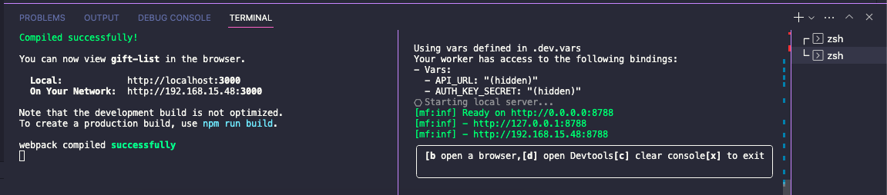

# gift-list
A simple and versatile check list of gifts for baby or bridal showers.

## Environment Variables

Environment variables in the development mode are obtained from `.env` file for the front end and from `.dev.vars` for the api.
The are both `.env.example` and `.dev.vars.example` inside project root. 

## Installing Dependencies

Run `npm ci`

## Installing New Package

Run `npm i` for packages that does into production build.
Run `npm i -D` for packages that does into development mode.

## Available Scripts

Follow the steps if you want to run the application.
In the project directory, you can run on different terminals:

### `npm run local:api`

Runs the environment api in the development mode.\
Open [http://localhost:8788](http://localhost:8788) to view it in your browser.

The api will reload when you make changes.\
You may also see logs about routes accessed.

### `npm run start`

Runs the app in the development mode.\
Open [http://localhost:3000](http://localhost:3000) to view it in your browser.

The page will reload when you make changes.\
You may also see any lint errors in the console.

You should end with something like this:

     

## Styling the project

Run `npm eslint` and `npm run prettier`. These commands will find errors and stylish the project.

## Contributing

All contributions, bug reports, bug fixes, docs improvements, enhancements, and ideas are welcome.
You can open PR's into branches `preview` or `master`. 
Finishing the merge, the deploy will be started automatically if the build runs without errors.
So before open a PR, be sure the build runned correctly:

### `npm run build`

Builds the app for production to the `build` folder.\
It correctly bundles React in production mode and optimizes the build for the best performance.

The build is minified and the filenames include the hashes.\
Your app is ready to be deployed if there is no errors!

#### Observations

The api used to read and manipulate data, is found into the api folder, on worker.js file and it's running into a cloudflare server.
